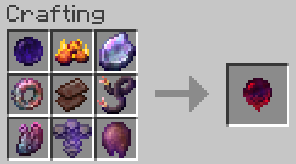

# Stronghold Essences

Requires exploration across the world to find the Stronghold and activate the End Portal.

## Hostile Essence
- Warden Essence (guaranteed Warden drop)
- Wither Essence (guaranteed Wither drop)
- Woodland Essence (guaranteed Evoker drop)
- Monument Essence (50% Elder Guardian drop)
- Trial Essence (added to ominous vault loot tables)
- Bastion Essence (added to best chest loot table)
- Ancient Essence (added to chest loot tables)
- Raid Essence (guaranteed Ravager drop)
- Netherite Scrap

## Passive Essence
- Cleric Essence (guaranteed Master Cleric trade)
- Librarian Essence (guaranteed Master Librarian trade)
- Trail Essence (added to Sus Sand/Gravel loot tables)
- Buried Essence (added to buried treasure loot table)
- Igloo Essence (guaranteed Igloo chest spawn)
- Colourful Essence (craftable)
- Lucky Essence (craftable)
- Saturating Essence (craftable)
- Netherite Scrap

## Stronghold Compass
- 6 Eyes of Ender
- Hostile Essence
- Passive Essence
- Compass

Eyes of Ender will not function until the Stronghold has been located.

The Stronghold Compass is required to activate the End Portal.

Stronghold rings are further away from spawn.

Woodland Mansions have less distance between each other.

## Crafting Recipes

### Colourful Essence

### Lucky Essence

### Saturating Essence

### Hostile Essence

### Passive Essence

### Stronghold Compass

## Credits

All textures (except the Stronghold Compass) come from [malcolmriley](https://github.com/malcolmriley/unused-textures). Thank you so much!